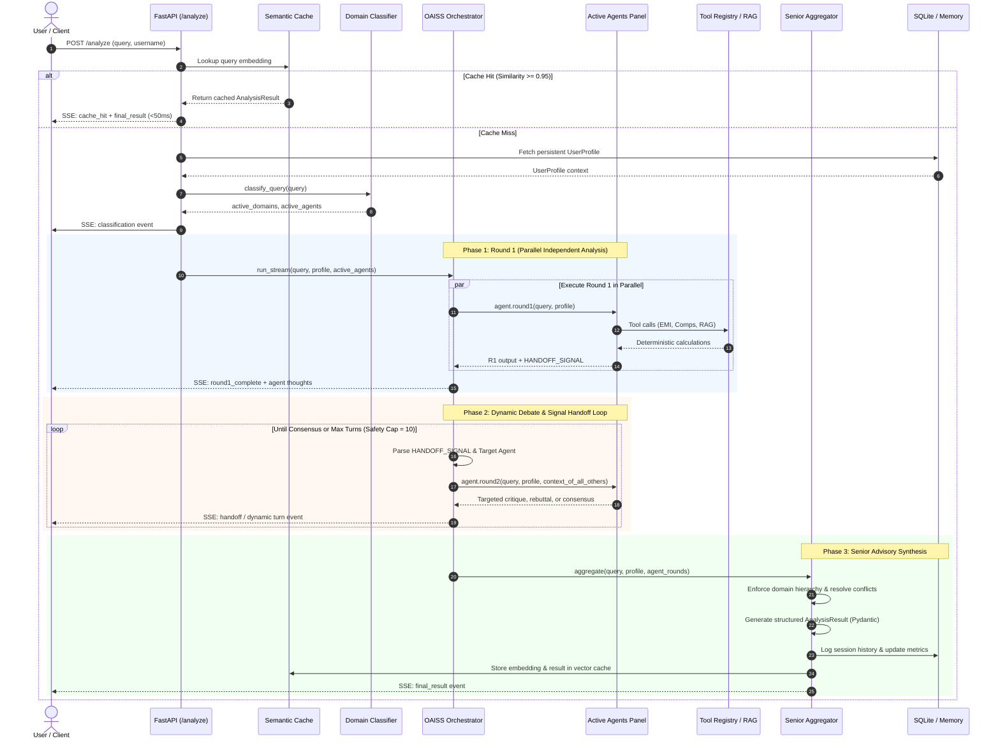
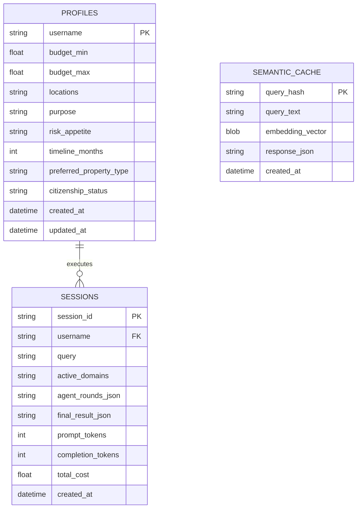

# 🏛️ Real Estate Advisory Multi-Agent System — System Architecture

---

## 1. Executive Architecture Overview

The **Real Estate Advisory Multi-Agent System (Swarm)** is an enterprise-grade decision intelligence platform designed to evaluate complex real estate acquisition, investment, and legal advisory queries. 

Unlike traditional monolithic LLM chatbots—which offer generalized, uncalibrated advice and struggle to balance contradictory priorities—this system employs **OAISS (Orchestrated Agent Interaction with Structured Synthesis)**. It coordinates a panel of five autonomous, domain-specialized AI experts who debate, stress-test, and refine their assessments in real time before a senior synthesizer produces a structured, actionable verdict.

```mermaid
flowchart TB
    subgraph ClientLayer ["🖥️ Presentation Layer (Streamlit)"]
        UI["User Interface (frontend/app.py)"]
        Sidebar["User Profile & Constraints"]
        SSEConsumer["SSE Streaming Consumer & State Store"]
        UI --> Sidebar
        UI --> SSEConsumer
    end

    subgraph APILayer ["⚡ API & Gateway Layer (FastAPI)"]
        API["FastAPI Server (backend/main.py)"]
        SSEEndpoint["/analyze (Server-Sent Events)"]
        ProfileEndpoint["/profile (User Memory CRUD)"]
        HistoryEndpoint["/history (Audit Trail)"]
        API --> SSEEndpoint
        API --> ProfileEndpoint
        API --> HistoryEndpoint
    end

    subgraph OptimizationLayer ["⚡ Performance & Caching"]
        Cache["Semantic Cache (backend/cache.py)"]
        Embedder["SentenceTransformer (all-MiniLM-L6-v2)"]
        RedisStorage["Redis / Local Vector Store (Cosine Similarity >= 0.95)"]
        Cache --> Embedder
        Cache --> RedisStorage
    end

    subgraph RoutingLayer ["🎯 Classification & Routing"]
        Classifier["Domain Classifier (backend/classifier.py)"]
    end

    subgraph OrchestrationLayer ["🧠 OAISS Multi-Agent Orchestrator"]
        Orchestrator["OAISS Engine (backend/orchestrator.py)"]
        Phase1["Phase 1: Parallel Independent Analysis (Round 1)"]
        Phase2["Phase 2: Dynamic Signal Handoff & Debate Loop"]
        SignalParser["Signal Parser (HANDOFF_SIGNAL / CONSENSUS)"]
        ConfidenceCalc["Confidence Calculator (backend/confidence.py)"]
        
        Orchestrator --> Phase1
        Phase1 --> SignalParser
        SignalParser --> Phase2
        Phase2 --> ConfidenceCalc
    end

    subgraph AgentPanel ["👥 Domain Specialized Agents (backend/agents/)"]
        Broker["🏠 Broker Agent (Market & Pricing)"]
        Investor["📈 Investor Agent (Yield & ROI)"]
        Legal["⚖️ Legal Agent (Title & RERA)"]
        Banker["🏦 Banker Agent (Mortgage & FOIR)"]
        Developer["🏗️ Developer Agent (Construction & Delays)"]
    end

    subgraph ToolingLayer ["🛠️ Tool Registry & Local Execution (backend/agents/tools.py)"]
        EMITool["calculate_emi"]
        LoanTool["assess_loan_eligibility"]
        PriceTool["fetch_property_pricing"]
        YieldTool["estimate_rental_yield"]
        LegalRAG["Legal Document Search (ChromaDB RAG)"]
    end

    subgraph KnowledgeLayer ["📚 Knowledge & Persistence"]
        SQLiteDB[("SQLite Database (swarm.db)")]
        ChromaDB[("ChromaDB Vector Store (legal_chroma_db)")]
        Memory["User Memory (backend/memory.py)"]
        Logger["Audit Logger (backend/logger.py)"]
        
        Memory --> SQLiteDB
        Logger --> SQLiteDB
        LegalRAG --> ChromaDB
    end

    subgraph SynthesisLayer ["📊 Senior Advisory Synthesis"]
        Aggregator["Senior Advisory Synthesizer (backend/aggregator.py)"]
        HierarchicalArbitration["Domain Hierarchy Arbitration (Legal > Financial > Investment > Market > Construction)"]
        StructuredSchema["Pydantic V2 Schema Validation (AnalysisResult)"]
        
        Aggregator --> HierarchicalArbitration
        HierarchicalArbitration --> StructuredSchema
    end

    subgraph ObservabilityLayer ["🔭 Observability & Telemetry"]
        Langfuse["Langfuse Tracing (@observe)"]
    end

    %% Wiring connections
    ClientLayer <-->|HTTP / SSE Streaming| APILayer
    SSEEndpoint --> Cache
    Cache -.->|Cache Hit (<50ms)| SSEEndpoint
    Cache -->|Cache Miss| Memory
    Memory --> Classifier
    Classifier --> Orchestrator
    
    Phase1 --> AgentPanel
    Phase2 --> AgentPanel
    
    AgentPanel <--> ToolingLayer
    AgentPanel -.-> Langfuse
    
    Orchestrator --> Aggregator
    Aggregator --> Logger
    Aggregator --> Cache
    Aggregator -.-> Langfuse
    Aggregator -->|Final Structured Payload| SSEEndpoint
```

---

## 2. Core Architectural Philosophy

### 2.1 Why Multi-Agent Over Monolithic Prompts?
1. **Persona Fidelity & Counteracting Biases**: A single prompt cannot simultaneously embody the aggressive optimism of a real estate broker and the paranoid risk-aversion of a property litigation lawyer without averaging out the nuances. Isolated personas preserve distinct mental models.
2. **Dynamic Cross-Examination**: In real estate, an attractive yield calculation from an investor is useless if a lawyer finds an encumbered land title. The system enables agents to cross-examine peer outputs before presenting a recommendation to the client.
3. **Deterministic Hierarchical Arbitration**: When conflicts occur, human domain hierarchy governs resolution:
   $$\text{Legal} \succ \text{Financial} \succ \text{Investment} \succ \text{Market} \succ \text{Construction}$$

---

## 3. The OAISS Protocol (Orchestrated Agent Interaction with Structured Synthesis)

The core orchestration lifecycle runs across three distinct phases:



### Signal Protocol Specification
Agents communicate handoffs and terminal states using structured token markers in their output:
- `HANDOFF_SIGNAL: <TARGET_AGENT> | <REASON>`: Hands control to a target specialist (e.g., `HANDOFF_SIGNAL: legal | Verify RERA registration number and occupancy certificate`).
- `HANDOFF_SIGNAL: CONSENSUS | <REASON>`: Emits consensus when no further debate is warranted.
- `HANDOFF_SIGNAL: NONE | <REASON>`: Neutral termination indicating the agent has completed its standalone assessment.

---

## 4. Deep-Dive Component Architecture

### 4.1 FastAPI Gateway & Streaming Pipeline ([backend/main.py](file:///d:/Swarm/backend/main.py))
- **Role**: Async REST API and real-time Server-Sent Events (SSE) server.
- **Key Endpoints**:
  - `POST /analyze`: Asynchronous SSE generator streaming live agent thoughts, tool invocations, debate turns, and the final synthesis.
  - `GET /health`: Liveness and readiness healthcheck.
  - `GET /profile/{username}` & `POST /profile`: User financial and preference profile memory management.
  - `GET /history/{username}`: Historical advisory sessions queryable by client.
- **Resilience**: Listens for HTTP client disconnects via `http_request.is_disconnected()` to abort background LLM calls cleanly and avoid orphan compute.

### 4.2 Semantic Vector Cache ([backend/cache.py](file:///d:/Swarm/backend/cache.py))
- **Embedding Model**: `sentence-transformers/all-MiniLM-L6-v2` (384-dimensional dense vectors).
- **Backend**: Redis Vector Cache with transparent, zero-config in-memory fallback.
- **Threshold**: Cosine similarity $\ge 0.95$ triggers instantaneous sub-50ms cache hits, avoiding redundant multi-agent LLM invocations.

### 4.3 Query Classifier & Dynamic Routing ([backend/classifier.py](file:///d:/Swarm/backend/classifier.py))
- Evaluates inbound queries to determine which subset of the 5 domains are strictly necessary.
- If a user asks only about *"legal RERA clearance in Bangalore"*, the classifier activates `legal` and `broker` while deactivating unneeded financial or developer agents, reducing latency and LLM token costs.

### 4.4 The 5 Specialized Domain Agents ([backend/agents/](file:///d:/Swarm/backend/agents/))

| Agent Class | Persona Name | Focus Domain | Inherent Bias | Tools & Capabilities |
|---|---|---|---|---|
| [BrokerAgent](file:///d:/Swarm/backend/agents/broker.py) | Ramesh Sharma | `market` | Bullish optimism, deal momentum | Market comparables, sqft pricing, rental benchmarks |
| [InvestorAgent](file:///d:/Swarm/backend/agents/investor.py) | Priya Menon | `investment` | Hyper-analytical yield skepticism | Cap rate, IRR, cash-on-cash return, exit liquidity |
| [LegalAgent](file:///d:/Swarm/backend/agents/legal.py) | Adv. Meena Krishnamurthy | `legal` | Extreme risk aversion, procedural pedantry | ChromaDB Legal RAG, title search, RERA litigation checks |
| [BankerAgent](file:///d:/Swarm/backend/agents/banker.py) | Deepak Agarwal | `financial` | Conservative debt underwriting | Reducing-balance EMI math, FOIR calculations, stress-testing |
| [DeveloperAgent](file:///d:/Swarm/backend/agents/developer.py) | Vikram Singhania | `construction` | Pragmatic execution optimism | Construction quality, delay probability, cost-per-sqft analysis |

### 4.5 Tool Registry & Local Execution Engine ([backend/agents/tools.py](file:///d:/Swarm/backend/agents/tools.py))
- Deterministic calculation tools exposed to agents via standard OpenAI tool calling schemas:
  - `calculate_emi(principal, annual_rate_pct, tenure_years)`: Precise reducing-balance monthly installment formula.
  - `assess_loan_eligibility(monthly_income, existing_emis, interest_rate, tenure_years)`: Bank-grade Fixed Obligation to Income Ratio (FOIR) underwriting.
  - `fetch_property_pricing(city, bhk_type)`: Micro-market historical pricing benchmarks across Tier-1/2 cities.
  - `estimate_rental_yield(city, bhk_type, property_price)`: Gross and net rental yield estimation.
  - `search_legal_knowledge(query)`: ChromaDB vector search against Indian property acts (RERA, Transfer of Property Act, Stamp Act).

### 4.6 Legal RAG Vector Search Pipeline ([backend/ingest_legal_docs.py](file:///d:/Swarm/backend/ingest_legal_docs.py))
- **Storage**: ChromaDB persistent vector collection (`legal_docs`).
- **Ingestion**: Token-based chunking with overlap across statutory legal corpora, title search guidelines, and RERA court judgments.

### 4.7 Senior Advisory Synthesizer ([backend/aggregator.py](file:///d:/Swarm/backend/aggregator.py))
- Consumes all Round 1 and Round 2 agent thoughts.
- Arbitrates disputes using the strict domain hierarchy.
- Synthesizes the structured `AnalysisResult` Pydantic payload, including:
  - Executive Recommendation (`PROCEED`, `PROCEED_WITH_CAUTION`, `DO_NOT_PROCEED`, `SEEK_MORE_INFO`).
  - Domain Breakdown with calibrated risk ratings (1–10).
  - Explicit Dissenting Opinions and trade-offs.
  - Prioritized Action Items with urgency categorization.

### 4.8 Persistence & Memory Layer ([backend/database.py](file:///d:/Swarm/backend/database.py))
- High-performance asynchronous SQLite database engine (`aiosqlite`) managing three primary schemas:
  1. `profiles`: Long-term user preferences (budget, risk appetite, citizenship, existing assets).
  2. `sessions`: Complete transcript records, agent metrics, token counts, and execution costs.
  3. `cache_entries`: Serialized semantic embeddings and responses.

### 4.9 Streamlit Presentation Client ([frontend/app.py](file:///d:/Swarm/frontend/app.py))
- Modern reactive dashboard featuring:
  - Live SSE Event Reader and Real-Time Agent Thought Stream.
  - Interactive Consensus & Debate Visualization.
  - Domain-wise Scorecards with visual risk indicators.
  - Historical Session Playback and Export to Structured PDF Reports.

---

## 5. Data Flow & Schema Architecture



---

## 6. Failure Modes, Resilience & Guardrails

| Risk / Failure Mode | Architectural Guardrail | Resolution Mechanism |
|---|---|---|
| **Infinite Agent Debate Loop** | `MAX_TURNS = 10` Hard Limit in [orchestrator.py](file:///d:/Swarm/backend/orchestrator.py) | Dynamic loop forcibly breaks and passes collected turns to Aggregator. |
| **Agent LLM Hang / API Latency** | `asyncio.wait_for(..., timeout=90.0)` | Timed-out agent yields fallback notice; remaining agents proceed unaffected. |
| **LLM Output Formatting Drift** | Pydantic V2 Type Enforcement in [aggregator.py](file:///d:/Swarm/backend/aggregator.py) | Retries structured extraction or falls back to robust heuristic parsing. |
| **Redis Infrastructure Failure** | Resilient `SemanticCache` fallback | Seamlessly switches to process-level in-memory cache without dropping requests. |
| **Client Disconnection During Stream** | Async `http_request.is_disconnected()` | Immediately halts execution pipeline to prevent wasted token expenditure. |
| **Uncalibrated AI Overconfidence** | Hedging & Certainty Analysis in [confidence.py](file:///d:/Swarm/backend/confidence.py) | Down-weights certainty scores when speculative phrasing is detected. |

---

## 7. Project File Directory & Module Map

```
Swarm/
├── backend/
│   ├── agents/
│   │   ├── base.py              # BaseAgent abstract class, LLM loop, Langfuse tracing
│   │   ├── banker.py            # BankerAgent (Mortgage & loan eligibility)
│   │   ├── broker.py            # BrokerAgent (Market pricing & rental yield)
│   │   ├── developer.py         # DeveloperAgent (Construction quality & delay risk)
│   │   ├── investor.py          # InvestorAgent (ROI, Cap Rate, IRR math)
│   │   ├── legal.py             # LegalAgent (RERA, title, statutory checks & RAG)
│   │   └── tools.py             # Tool schemas & deterministic Python implementations
│   ├── aggregator.py            # Senior Advisory Synthesizer (Pydantic aggregation)
│   ├── cache.py                 # Semantic vector cache (SentenceTransformers + Redis)
│   ├── classifier.py            # Rule/keyword-based domain classifier
│   ├── confidence.py            # Hedging & calibration algorithm
│   ├── config.py                # Pydantic BaseSettings environment configuration
│   ├── database.py              # Asynchronous SQLite persistence layer
│   ├── debate.py                # Fixed two-round debate engine fallback
│   ├── ingest_legal_docs.py     # Document ingestion script for ChromaDB
│   ├── logger.py                # Session logging and audit history retrieval
│   ├── main.py                  # FastAPI application entrypoint & SSE endpoints
│   ├── memory.py                # UserProfile state management
│   ├── models.py                # Pydantic data schemas & request/response contracts
│   └── orchestrator.py          # OAISS dynamic handoff orchestrator
├── data/
│   └── legal_chroma_db/         # ChromaDB persistent vector storage for legal RAG
├── frontend/
│   └── app.py                   # Streamlit web dashboard application
├── tests/                       # Unit & integration test suites
├── Dockerfile.backend           # Backend container definition
├── Dockerfile.frontend          # Frontend container definition
├── docker-compose.yml           # Multi-container orchestration specification
├── requirements.txt             # Python project dependencies
├── swarm.db                     # SQLite persistent database file
├── ARCHITECTURE.md              # This architecture specification document
└── Readme.md                    # Project README and quickstart guide
```

---

## 8. How to Extend the Architecture

### Adding a New Agent Persona
1. Create `backend/agents/tax_advisor.py` inheriting from `BaseAgent`.
2. Define `agent_id`, persona metadata, biases, and self-correction guidelines.
3. Register the agent in `ALL_AGENTS` in [backend/main.py](file:///d:/Swarm/backend/main.py) and update [backend/classifier.py](file:///d:/Swarm/backend/classifier.py).

### Adding a New Calculation Tool
1. Define the Python calculation function in [backend/agents/tools.py](file:///d:/Swarm/backend/agents/tools.py).
2. Define its OpenAI JSON schema in the tool registry.
3. Bind the tool to the appropriate agent persona in `_llm_with_tools()`.
