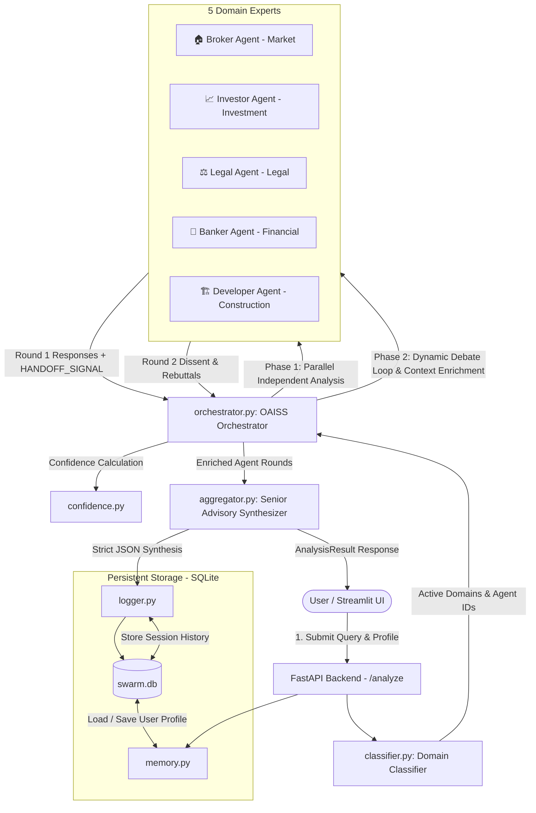

# 🏘️ Real Estate Advisory Multi-Agent System — Complete Project Documentation

---

## 📖 Executive Summary

The **Real Estate Advisory Multi-Agent System** is an enterprise-grade decision intelligence platform designed to evaluate complex real estate investment queries. Rather than relying on a single, monolithic large language model (which is prone to generic advice, uncalibrated confidence, and overlooked domain nuances), this platform implements the **OAISS (Orchestrated Agent Interaction with Structured Synthesis)** multi-agent architecture.

Five autonomous, domain-specialized AI experts collaborate, challenge each other's assumptions, debate trade-offs across two structured rounds, and reach an arbitrated consensus. The final output is a structured, confidence-weighted investment advisory report with domain breakdowns, risk alerts, and actionable follow-ups.

---

## 🎯 Key Project Goals & Differentiators

| Traditional Chatbot Approach | This Multi-Agent Advisory System |
|---|---|
| Single prompt, single perspective | 5 specialized personas with distinct mental models and biases |
| Surface-level optimism or hallucinations | Rigorous adversarial debate with explicit dissent tracking |
| Unstructured text responses | Strict, typed JSON / Pydantic schema with structured UI tabs |
| No persistent profile context | Cross-session persistent user investment profiles in SQLite |
| Uncalibrated confidence | Algorithmic hedging/uncertainty analysis + synthesis confidence scoring |
| Flat decision logic | Strict domain hierarchy (*Legal > Financial > Investment > Market > Construction*) |

---

## 🧠 System Architecture & Workflow



---

## 👥 The 5 Specialized Domain Experts

Each agent is configured with a distinct identity, backstory, specific focus domain, known behavioral biases, and self-correction rules:

### 1. 🏠 Real Estate Broker Agent (`BrokerAgent`)
- **Persona**: Ramesh Sharma — 15+ years of Tier-1 and Tier-2 market experience.
- **Domain**: `market`
- **Goal**: Assess micro-market trends, location desirability, pricing realism, inventory comparables, and negotiation leverage.
- **Known Bias**: Natural optimism and deal momentum bias.
- **Self-Correction Rule**: Explicitly caveat bullish statements with conservative alternative views.
- **Debate Interaction**: Validates developer claims against market realities and provides pricing strategies to ease bank financing burdens.

### 2. 📈 Property Investor Agent (`InvestorAgent`)
- **Persona**: Priya Menon — Professional real estate investor managing a ₹15 Cr+ portfolio.
- **Domain**: `investment`
- **Goal**: Evaluate ROI, rental yield, Capitalization Rate (Cap Rate), Internal Rate of Return (IRR), cash-on-cash return, exit liquidity, and vacancy risks.
- **Known Bias**: Extreme skepticism and hyper-fixation on yield math at the expense of lifestyle or emotional value.
- **Self-Correction Rule**: Recognize when a purchase is for personal self-use where pure investment yield formulas may not apply.
- **Debate Interaction**: Challenges broker projections with quantitative rental models and factors legal risks into required risk-premiums.

### 3. ⚖️ Property Lawyer Agent (`LegalAgent`)
- **Persona**: Advocate Meena Krishnamurthy — Senior advocate with 20 years in property litigation and title searches.
- **Domain**: `legal`
- **Goal**: Uncover title defects, RERA compliance gaps, encumbrances, zoning constraints, agricultural land restrictions, stamp duty/registration liabilities, and litigation histories.
- **Known Bias**: Ultra-conservative risk aversion; treating minor procedural paperwork as deal-breakers.
- **Self-Correction Rule**: Differentiate between fatal deal-breakers (unresolved litigation/encumbered titles) and remediable procedural items (builder NOC pending).
- **Debate Interaction**: **Legal findings strictly override all commercial and financial optimism.** Validates whether broker listings and builder claims are legally enforceable.

### 4. 🏦 Banker & Mortgage Agent (`BankerAgent`)
- **Persona**: Deepak Agarwal — Veteran mortgage expert with 25 years of experience processing 5,000+ home loans.
- **Domain**: `financial`
- **Goal**: Determine affordability, Debt-to-Income (DTI) ratios, EMI stress-testing under interest rate rate-hikes, down payment requirements, and loan disbursement milestones.
- **Known Bias**: Overly conservative stress-testing; bias favoring salaried W-2 profiles over self-employed borrowers.
- **Self-Correction Rule**: Acknowledge structured financial buffers when evaluating sound, non-traditional borrowers.
- **Debate Interaction**: Translates market prices into concrete monthly cash outflows and evaluates construction-linked disbursement risks.

### 5. 🏗️ Developer & Builder Agent (`DeveloperAgent`)
- **Persona**: Vikram Nair — Civil engineer turned developer with 2M+ sq. ft. of residential and commercial development experience.
- **Domain**: `construction`
- **Goal**: Inspect construction quality, builder track records, delivery timeline delays, structural defects, carpet-area efficiency, and realistic renovation estimates.
- **Known Bias**: Faith in established developers; underestimating timeline slips and renovation expenses on resale properties.
- **Self-Correction Rule**: Explicitly account for builder delay histories and quality complaints.
- **Debate Interaction**: Assesses whether structural quality justifies pricing premiums and checks Occupancy Certificate (OCC) statuses.

---

## 🔄 End-to-End Execution Pipeline

When a request is submitted to the system via the Web UI or API, the following pipeline executes:

### Step 1: User Profile Retrieval & Personalization
- The system loads the user's persistent profile (`UserProfile`) from the SQLite database via [backend/memory.py](file:///c:/Users/utkar/Desktop/Swarm/backend/memory.py).
- Profile attributes include:
  - `budget_min` & `budget_max` (INR)
  - `purpose` (`investment`, `self_use`, `commercial`)
  - `risk_appetite` (`low`, `medium`, `high`)
  - `timeline_months`
  - `location_preference` (list of cities/suburbs)
  - `preferred_property_type` (e.g. 2-BHK, Villa, Commercial)
  - `existing_properties` count
  - `citizenship_status` (e.g. Resident Indian, NRI, OCI)
  - `loan_eligibility_known` (boolean)

### Step 2: Domain Classification & Dynamic Agent Selection
- [backend/classifier.py](file:///c:/Users/utkar/Desktop/Swarm/backend/classifier.py) inspects the user query using domain keyword clustering.
- It identifies matching domains from: `market`, `financial`, `investment`, `legal`, `construction`.
- Active agents are dynamically selected based on query relevance. (If no specific keywords match, all 5 agents are activated).

### Step 3: OAISS Orchestration & Multi-Round Debate
The orchestrator ([backend/orchestrator.py](file:///c:/Users/utkar/Desktop/Swarm/backend/orchestrator.py)) executes a multi-phase interaction loop:
1. **Phase 1 (Parallel Round 1)**: All activated agents run their initial, independent analysis concurrently using `asyncio.gather` with a per-agent timeout of 90 seconds.
2. **Phase 2 (Dynamic OAISS Loop & Handoffs)**:
   - Agents emit signals parsed via regex: `HANDOFF_SIGNAL: <agent_id> | <reason>` or `HANDOFF_SIGNAL: CONSENSUS | <reason>`.
   - If an agent hands off to another agent (e.g. Broker hands off to Legal due to title doubts), that agent is prioritized in the execution queue with full contextual history.
   - In Round 2, agents are strictly instructed to reference colleagues by name, specify agreements or dissents, and contribute only net-new insights.
   - The loop terminates on `CONSENSUS`, when the queue is exhausted, or upon hitting `MAX_TURNS = 10`.

### Step 4: Algorithmic Uncertainty & Confidence Analysis
- [backend/confidence.py](file:///c:/Users/utkar/Desktop/Swarm/backend/confidence.py) scores the uncertainty of each agent's statements by counting hedging markers (`might`, `perhaps`, `unclear`, `depends`, `potentially`, `likely`, etc.):
  - `< 2 markers`: **High Confidence**
  - `2 to 5 markers`: **Medium Confidence**
  - `> 5 markers`: **Low Confidence**

### Step 5: Senior Advisory Synthesis & Hierarchical Conflict Resolution
- [backend/aggregator.py](file:///c:/Users/utkar/Desktop/Swarm/backend/aggregator.py) acts as the Senior Real Estate Advisory Manager.
- When agents disagree, the aggregator applies strict domain hierarchy rules:
  $$\mathbf{Legal} \succ \mathbf{Financial} \succ \mathbf{Investment} \succ \mathbf{Market} \succ \mathbf{Construction}$$
- It outputs a validated JSON payload adhering to `AnalysisResult`:
  - `summary`: Concise executive synthesis.
  - `key_insights`: Per-domain breakdown (`market`, `investment`, `legal`, `financial`, `construction`).
  - `risks`: Ranked list of critical risks and caveats.
  - `recommendation`: Categorical verdict (`Buy`, `Avoid`, `Consider`, or `Needs more info`).
  - `confidence_score`: 1–10 overall score.
  - `agent_views`: Agent-specific key points, confidence rating, and explicit `dissents_from` lists.
  - `follow_up_questions`: Intelligent follow-up prompts to guide the user's next steps.

### Step 6: Session Logging & Audit Trail
- [backend/logger.py](file:///c:/Users/utkar/Desktop/Swarm/backend/logger.py) writes the full transcript (query, active domains, Round 1 inputs, Round 2 debate, and aggregated response) to SQLite table `sessions` for auditability, benchmarking, and review.

---

## 💻 Frontend Application Overview

The frontend ([frontend/app.py](file:///c:/Users/utkar/Desktop/Swarm/frontend/app.py)) is an interactive Streamlit web application featuring:

1. **Authentication Screen**: Secure sign-in workflow supporting OAuth / Streamlit authentication.
2. **Persistent Profile Sidebar**: Interactive controls for setting budget ranges, investment goals, risk thresholds, location preferences, and mortgage readiness.
3. **Executive Summary Card**: Visual recommendation badge (`BUY` in emerald, `AVOID` in crimson, `CONSIDER` in amber, `NEEDS MORE INFO` in cobalt) and an animated confidence score bar.
4. **4 Tabbed Analysis Views**:
   - **🔑 Key Insights Tab**: Dedicated cards for Market, Legal, Financial, Investment, and Construction breakdowns.
   - **🤝 Agent Debates Tab**: Collapsible accordions for each agent showing confidence pills, dissent badges (`⚡ Disagrees with Legal`), Round 1 independent reasoning, and Round 2 debate reactions.
   - **⚠️ Risks Tab**: Highlighted risk alerts extracted across all expert contributions.
   - **❓ Follow-ups Tab**: Interactive one-click buttons that automatically populate the query box for follow-up investigations.
5. **📜 History Tab**: Historical view of past advisory queries, recommendations, and confidence ratings.

---

## 🔌 REST API Reference

The FastAPI backend exposes the following endpoints:

### 1. Health Check
- **Endpoint**: `GET /health`
- **Response**:
  ```json
  {
    "status": "ok",
    "version": "1.0.0"
  }
  ```

### 2. Run Advisory Analysis
- **Endpoint**: `POST /analyze`
- **Request Body**:
  ```json
  {
    "query": "Should I purchase a 3-BHK in Hinjewadi Phase 1, Pune for ₹1.2 Cr to generate rental income?",
    "username": "investor_user"
  }
  ```
- **Response Schema (`AnalysisResult`)**:
  ```json
  {
    "summary": "Executive summary of the debate...",
    "key_insights": {
      "market": "Market analysis...",
      "investment": "Rental yield & ROI analysis...",
      "legal": "Title and RERA verification...",
      "financial": "EMI and cash flow impact...",
      "construction": "Builder quality & amenities..."
    },
    "risks": ["Risk point 1", "Risk point 2"],
    "recommendation": "Consider",
    "confidence_score": 8,
    "agent_views": [
      {
        "agent": "Legal",
        "key_points": ["Verified RERA registration", "Check OC status"],
        "confidence": "high",
        "dissents_from": ["Broker"]
      }
    ],
    "follow_up_questions": [
      "Has the builder obtained the Occupancy Certificate for Phase 1?"
    ],
    "active_domains": ["market", "investment", "legal", "financial", "construction"],
    "agent_rounds": [ ... ]
  }
  ```

### 3. User Profile Management
- **Endpoint**: `POST /profile` — Create or update user profile.
- **Endpoint**: `GET /profile/{username}` — Retrieve stored user profile.

### 4. Query History & Audit
- **Endpoint**: `GET /history/{username}?limit=20` — Retrieve past advisory sessions for a user.
- **Endpoint**: `GET /history?limit=50` — Administrative endpoint for all platform sessions.

---

## 🗄️ Database Schema

The system uses an asynchronous SQLite database (`swarm.db` via `aiosqlite`):

### Table: `user_profiles`
| Column | Type | Description |
|---|---|---|
| `username` | `TEXT PRIMARY KEY` | Unique user identifier / email |
| `profile_json` | `TEXT NOT NULL` | Serialized JSON containing all user financial & property preferences |
| `updated_at` | `TEXT NOT NULL` | ISO 8601 UTC timestamp of last update |

### Table: `sessions`
| Column | Type | Description |
|---|---|---|
| `id` | `INTEGER PRIMARY KEY AUTOINCREMENT` | Session identifier |
| `username` | `TEXT NOT NULL` | User associated with session |
| `query` | `TEXT NOT NULL` | Raw real estate question submitted |
| `domains_json` | `TEXT` | Array of classified domains |
| `round1_json` | `TEXT` | Agent responses from Round 1 |
| `round2_json` | `TEXT` | Agent debate responses from Round 2 |
| `output_json` | `TEXT NOT NULL` | Final synthesized `AnalysisResult` JSON |
| `created_at` | `TEXT NOT NULL` | ISO 8601 UTC timestamp of session creation |

---

## 📁 Repository Structure & File Map

```
Swarm/
├── backend/
│   ├── agents/
│   │   ├── __init__.py          # Agents module export
│   │   ├── base.py              # BaseAgent abstract class & prompt formatting
│   │   ├── banker.py            # Financial & mortgage expert persona
│   │   ├── broker.py            # Market & pricing broker persona
│   │   ├── developer.py         # Builder & construction quality expert persona
│   │   ├── investor.py          # Portfolio & yield investor persona
│   │   └── legal.py             # Property litigation & compliance lawyer persona
│   ├── aggregator.py            # Senior Advisor arbitration & JSON synthesis
│   ├── classifier.py            # Keyword domain routing & agent activation
│   ├── confidence.py            # Hedging marker analysis & confidence scoring
│   ├── config.py                # Environment configuration loader
│   ├── database.py              # SQLite schema initialization (aiosqlite)
│   ├── debate.py                # Static two-round debate engine helper
│   ├── logger.py                # Session logging and history retrieval
│   ├── main.py                  # FastAPI server & route definitions
│   ├── memory.py                # User profile persistence layer
│   ├── models.py                # Pydantic data contracts & schemas
│   └── orchestrator.py          # Dynamic OAISS runtime loop & handoff engine
├── frontend/
│   └── app.py                   # Full Streamlit frontend with glassmorphism UI
├── app.py                       # Standalone Streamlit prompt-builder demo
├── requirements.txt             # Python package dependencies
├── .env                         # Environment configuration file
├── swarm.db                     # SQLite database file
├── Readme.md                    # Project README
└── PROJECT_DOCUMENTATION.md     # This comprehensive document
```

---

## ⚙️ Configuration & Environment Variables

Environment settings are managed via `.env` and loaded through `backend/config.py`:

| Variable | Default Value | Description |
|---|---|---|
| `LLM_BASE_URL` | `http://localhost:11434/v1` | Base URL for OpenAI-compatible LLM endpoint (Ollama, vLLM, OpenAI, Groq) |
| `LLM_MODEL` | `llama3.2` | Model identifier to use for all agents and aggregator |
| `LLM_API_KEY` | `ollama` | API authentication key (`ollama` for local setups) |
| `DB_PATH` | `swarm.db` | Local SQLite database file path |
| `BACKEND_URL` | `http://localhost:8000` | Address used by the Streamlit frontend to reach FastAPI |
| `AGENT_TIMEOUT` | `90` | Per-agent LLM timeout limit in seconds |

---

## 🚀 Running the Project

### 1. Install Dependencies
```bash
pip install -r requirements.txt
```

### 2. Launch Backend
```bash
uvicorn backend.main:app --reload --port 8000
```

### 3. Launch Frontend
```bash
streamlit run frontend/app.py --server.port 8501
```
